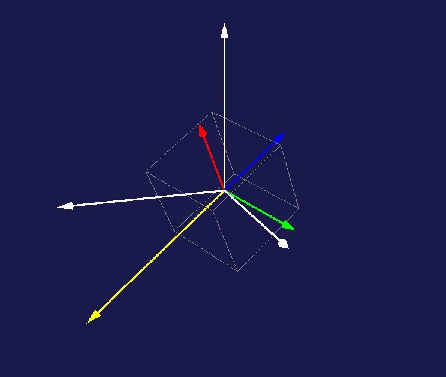

## 機体座標系と基準座標系

人工衛星の回転と制御を考えるためには２つの座標系が必要となります．

### 機体座標系
人工衛星の回転運動では，その形状や質量分布から決まる慣性テンソルが必要になります．
慣性テンソルがどんな行列になるかは衛星に座標軸を設定してこそ計算可能になります．また，衛星にトルクを作用させるホイールやトルカが衛星においてどの向きに設置されているかも衛星に座標軸を設定して記述されます．

このように衛星の回転運動を考えるにあたって，その回転を特徴づけるテンソルや，トルクの発生を担うアクチュエータの設定を式で表現するには，衛星に固定されている座標軸が必要となります．衛星が回転すればその座標軸も回転します．この座標系を**機体座標系**（固定座標系）と呼びます．

この座標系を用いると，衛星がどの軸を回転軸としてどんな角速度で回転しているかも表現することができます．回転軸を機体座標系における3次元の単位ベクトル（方向だけが重要なので大きさは $1$ の単位ベクトルとします）で表します．回転速度の大きさを表す角速度がスカラで表し（右ねじの向きの回転の場合を正，そうでない場合は負とします），それと回転軸の単位ベクトルを掛け算したも（ 3 次元ベクトルとなります）は，角速度ベクトル $\omega$ と呼ばれます．回転が速いほど長さが長くなるベクトルです．

### 基準座標系
衛星の角速度ベクトルが得られたなら，
つぎは衛星の姿勢どの方向を向いているか）を計算したくなります．
衛星の姿勢は**基準座標系**（静止座標系，慣性座標系）を使います．姿勢が変われば機体座標軸もそれにくっついて回転するので姿勢が変化しても機体座標系だけでは解析できません．
基準座標系は空間において絶対的な，
俯瞰でみたとき止まっている座標系です．衛星はその座標系の原点を回転中心としてくるくる回転しているものとなります． 

上の図は回転しているときの一瞬です．白い座標系は静止していて，赤青緑の座標系は動いています．黄色の矢印は角速度ベクトルを表しています．
